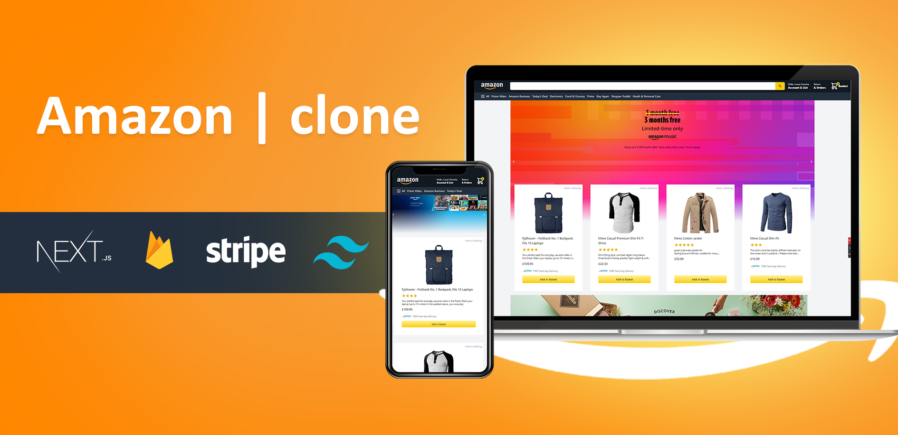

<div align="center">
  

</div>

## Sobre o Projeto
Aplicação realizada seguindo tutorial [AMAZON REACT.JS Challenge](https://www.youtube.com/watch?v=oq0B7XUNbtk). Uma ótima playlist para quem quer explorar funcionalidades do [NextJs](https://nextjs.org/) e [tailwindcss](https://tailwindcss.com/). A aplicação consiste em uma página home com uma lista de produtos fornecidos pela [fakestoreapi](https://fakestoreapi.com/) e uma página de carrinho com os itens que foram adicionados atrávez de estado global [Redux Toolkit](https://redux-toolkit.js.org//). O Checkout foi construido com o ambiente teste do [Strapi](https://stripe.com/br) e as informações de usuário e id de pagamento armazenadas com [Firebase](https://firebase.google.com/).


### 🛠 Tecnologias
As seguintes ferramentas foram usadas na construção do projeto:

- <a href="https://reactnative.dev/" > NextJs</a>
- <a href="https://tailwindcss.com/"> Tailwindcss </a>
- <a href="https://redux-toolkit.js.org//"> Redux Toolkit </a>
- <a href="https://next-auth.js.org/" > NextAUTH</a>
- <a href="https://heroicons.com/" > HeroIcons</a>
- <a href="https://stripe.com/br" > Stripe</a>
- <a href="https://firebase.google.com/" > Firebase</a>

### 🎲 Rodando o projeto

```bash
# Instale as dependências
$ yarn install
# ou
$ npm install

# Execute a aplicação
$ yarn dev
# ou
$ npm run dev
```